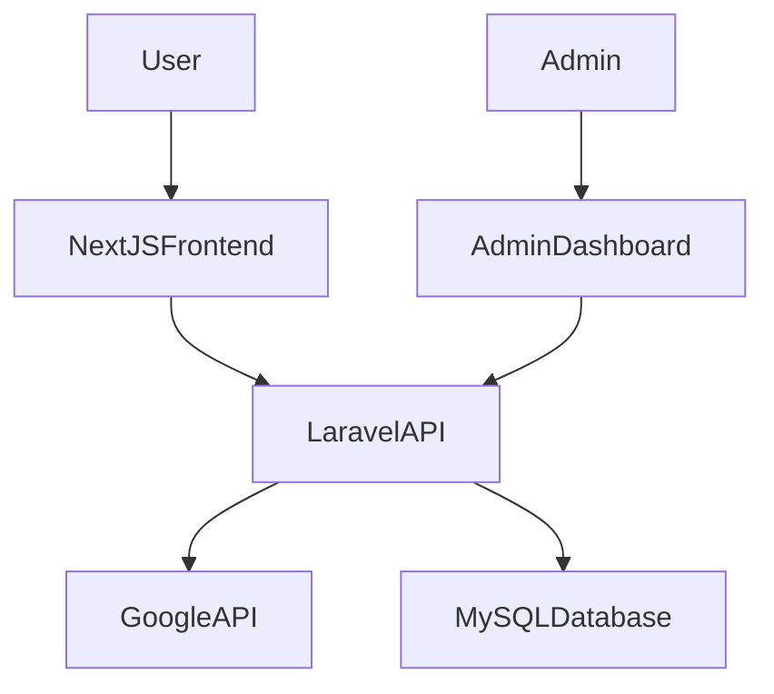

# 📱 APKMate – Android Apps & Games Download Platform

APKMate is an Android application download platform designed to help users discover and download Android apps and games, even if those applications are not available in their region on the Google Play Store.

In many countries, certain apps are restricted or unavailable due to regional limitations. APKMate solves this problem by integrating Google APIs to fetch app information and making those apps accessible through a web platform.

The system stores application data in a MySQL database and delivers a fast browsing experience through a **Next.js frontend** and **Laravel REST API backend**.

---

# 🚀 Features

## 🔍 App Discovery
Users can explore applications through multiple sections:

- Trending apps
- Popular apps
- Latest updates
- Editor’s choice
- Recently viewed apps

---

## 🔎 Advanced Search
Users can quickly find apps using:

- App name search
- Category browsing
- Trending keywords

---

## 📄 App Details Page
Each application includes detailed information such as:

- App version
- Rating
- Number of downloads
- Description
- Screenshots
- Similar apps
- APK download option

---

## 📂 Category System
Applications are organized into categories such as:

- Games
- Applications
- Productivity
- Tools
- Entertainment

---

## 🛠 Admin Dashboard

The admin panel allows management of:

- Applications
- Categories
- Advertisements
- Blocked apps
- Utilities
- Website content

---

# 🔗 Google API Integration

Application data is fetched from **Google App APIs**, then processed and stored in the local database to provide faster browsing and search performance.

---

# 🧠 Problem It Solves

Many Android applications are not available in certain countries through the Google Play Store.

APKMate solves this problem by providing a platform where users can browse and download APK files of those applications, making them accessible even in restricted regions.

---

# 🛠 Tech Stack

### Frontend
- Next.js
- JavaScript

### Backend
- Laravel REST API
- PHP

### Database
- MySQL

### API
- Google App Data API

---

# 🏗 System Architecture

---

# ⚙ Application Flow

1. User visits the APKMate website.
2. Next.js frontend requests application data from the Laravel API.
3. Laravel API fetches data from:
   - Google App APIs
   - Local MySQL database
4. Processed data is returned to the frontend.
5. Users can browse apps, view details, and download APK files.

---

# 🔮 Future Improvements

- User authentication system
- App review and rating system
- Download analytics
- Progressive Web App (PWA)
- Personalized app recommendations

---

## 👨‍💻 Developer

**Md Atikur Rahman**

Full Stack Web Developer  
CSE Student – State University of Bangladesh

---

## 📫 Contact

LinkedIn:  https://www.linkedin.com/in/atikurrahman1587

Github:  https://github.com/atikurrahman1587

Email: atikurrahman1587@gmail.com
